<h3><code>sandeep@github ~ $ whoami</code></h3>

<table>
  <tr>
    <td valign="top" width="370"></td>
    <td valign="top" width="490"></td>
  </tr>
</table>

 

<h3><code>sandeep@github ~ $ ./contributions.sh</code></h3>

  

<h3><code>sandeep@github ~ $ cat contact.txt</code></h3>

<a href="https://sandeepkumarmd.vercel.app">Portfolio</a> ·
<a href="mailto:mdsandeepkumar12@gmail.com">Email</a> ·
<a href="https://github.com/sandeep-md-12?tab=repositories">Repositories</a>

  

Heatmap refreshes daily via GitHub Actions · art generated by <code>scripts/</code>

